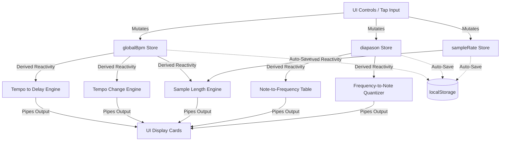

# PRODUCTION SPECIFICATION MATRIX: MUSICMATH CUSTOM

This document serves as the comprehensive, final architectural and computational specification for the **MusicMath** application. It outlines the system architecture, reactive state mechanisms, responsive layout guidelines, low-latency audio subsystems, and the exact mathematical formulas and JavaScript implementations for the core engine modules.

---

## TABLE OF CONTENTS
1. [SYSTEM ARCHITECTURE & STATE BUS](#1-system-architecture--state-bus)
2. [RESPONSIVE DESIGN & CSS SYSTEM](#2-responsive-design--css-system)
3. [CORE COMPUTATIONAL MODULES](#3-core-computational-modules)
   - [Module 1: Timecode Calculator](#module-1-timecode-calculator)
   - [Module 2: Tap Tempo & Metronome](#module-2-tap-tempo--metronome)
   - [Module 3: Tempo to Delay Converter](#module-3-tempo-to-delay-converter)
   - [Module 4: Note to Frequency Table Converter](#module-4-note-to-frequency-table-converter)
   - [Module 5: Sample Length Converter](#module-5-sample-length-converter)
   - [Module 6: Tempo Change Converter](#module-6-tempo-change-converter)
   - [Module 7: Frequency to Note Converter](#module-7-frequency-to-note-converter)
4. [LOW-LATENCY AUDIO ARCHITECTURE](#4-low-latency-audio-architecture)
5. [VERIFICATION & TESTING STRATEGY](#5-verification--testing-strategy)

---

## 1. SYSTEM ARCHITECTURE & STATE BUS

### Framework & Target Environment
MusicMath is architected as a zero-dependency, standalone Progressive Web Application (PWA) built using SvelteKit. The application compiles to static client-side files, enforcing zero server runtimes.

* **Static Compilation:** Configured via `@sveltejs/adapter-static` with prerendering explicitly enforced in the root layout:
  ```javascript
  // src/routes/+layout.js
  export const prerender = true;
  export const ssr = false; // Pure single-page client application
  ```
* **Offline Lifecycle:** A custom Service Worker (`src/service-worker.js`) implements a cache-first strategy for core assets (HTML, compiled JS, CSS, and manifest resources), registering them during installation and serving them directly offline.
* **State Serialization:** User preferences, historical calculations, and customized temperaments are persisted across reboots via synchronous writes to `localStorage` triggered by Svelte store mutations.

### Reactive State Bus
The reactive topology utilizes native Svelte stores (`writable` and `derived`). Three central metrics coordinate cross-module computations:

* `$globalBpm`: The active tempo (Beats Per Minute) used for metronome and tempo/time conversions.
* `$diapason`: The reference frequency of $A_4$ (default: $440\text{ Hz}$) used for pitch conversions.
* `$sampleRate`: The hardware audio sample rate (default: $48000\text{ Hz}$) used for audio buffer conversions.

#### Svelte Reactivity Flow


---

## 2. RESPONSIVE DESIGN & CSS SYSTEM

The visual interface is built with semantic HTML elements and component-scoped Vanilla CSS rules. It adheres to a strict mobile-first design system that scales seamlessly from small viewports up to high-resolution displays.

### Design Tokens (CSS Custom Properties)
```css
:root {
  /* Color Palette (Dark Theme / Glassmorphism) */
  --bg-main: #090a0f;
  --surface-card: rgba(18, 20, 32, 0.7);
  --surface-card-border: rgba(255, 255, 255, 0.08);
  --text-primary: #f3f4f6;
  --text-muted: #9ca3af;
  
  /* Primary Brand Accent Colors */
  --accent-blue: #1a56db;
  --accent-blue-hover: #2563eb;
  --accent-teal: #0d9488;
  
  /* Typography and Layout Scale */
  --font-mono: ui-monospace, SFMono-Regular, Menlo, Monaco, Consolas, monospace;
  --font-sans: system-ui, -apple-system, BlinkMacSystemFont, "Segoe UI", Roboto, sans-serif;
  --radius-card: 12px;
  --backdrop-blur: blur(12px);
}
```

### Global Styling Reset
```css
*, *::before, *::after {
  box-sizing: border-box;
}

body {
  background-color: var(--bg-main);
  color: var(--text-primary);
  font-family: var(--font-sans);
  margin: 0;
  padding: 0;
  overflow-x: hidden;
  line-height: 1.5;
  -webkit-font-smoothing: antialiased;
}
```

### Mobile-First Layout Pipeline
Layouts are declared mobile-first using CSS Grid and Flexbox. Below is the responsive column grid pipeline based on device viewports:

```css
/* Core Layout (<360px viewports) */
.module-grid {
  display: flex;
  flex-direction: column;
  gap: 1rem;
  padding: 1rem;
}

/* Responsive Viewports Pipeline */
@media (min-width: 22.5em) { /* 360px */
  .module-grid { padding: 1.25rem; }
}

@media (min-width: 37.5em) { /* 600px - Small Tablets */
  .module-grid {
    display: grid;
    grid-template-columns: repeat(2, 1fr);
    gap: 1.25rem;
  }
}

@media (min-width: 50em) { /* 800px - Tablets */
  .module-grid {
    grid-template-columns: repeat(3, 1fr);
  }
}

@media (min-width: 64em) { /* 1024px - Desktop */
  .module-grid {
    grid-template-columns: repeat(4, 1fr);
    max-width: 1400px;
    margin: 0 auto;
  }
}

@media (min-width: 100em) { /* 1600px - Large Desktop */
  .module-grid {
    grid-template-columns: repeat(5, 1fr);
  }
}
```

---

## 3. CORE COMPUTATIONAL MODULES

### Module 1: Timecode Calculator
Processes mathematical operations over frame-accurate time strings. To maintain fluid interactions, inputs are sanitized via regular expressions instead of character masks.

#### Frame Rates Supported
* **Non-Drop Rates:** $23.976\text{ (nominal 24)}$, $24$, $25$, $29.97\text{ NDF (nominal 30)}$, $30$, $50$, $59.94\text{ NDF (nominal 60)}$, $60$.
* **Drop-Frame Rates:** $29.97\text{ DF}$ (drops 2 frames/min), $59.94\text{ DF}$ (drops 4 frames/min).

#### Mathematical Formulation
Let $fps$ be the nominal frame rate (e.g. $30$ or $60$).
Let $D$ be the drop frame drop rate ($2$ for $29.97\text{ DF}$, $4$ for $59.94\text{ DF}$).
Let $H, M, S, F$ be the hours, minutes, seconds, and frames of a timecode.

1. **Timecode to Absolute Frame Index ($N$):**
   $$M_{\text{total}} = 60H + M$$
   $$S_{\text{total}} = 60M_{\text{total}} + S$$
   $$N_{\text{nominal}} = S_{\text{total}} \times \lceil fps \rceil + F$$
   If drop-frame:
   $$N = N_{\text{nominal}} - D \times \left( M_{\text{total}} - \left\lfloor \frac{M_{\text{total}}}{10} \right\rfloor \right)$$

2. **Absolute Frame Index ($N$) to Timecode:**
   Let $N_{\text{10min}}$ be the frames in 10 minutes: $N_{\text{10min}} = 10 \times 60 \times \lceil fps \rceil - 9 \times D$.
   Let $N_{\text{min}}$ be the frames in a drop minute: $N_{\text{min}} = 60 \times \lceil fps \rceil - D$.
   Let $N_{\text{nominal\_min}}$ be the frames in a nominal (non-drop) minute: $N_{\text{nominal\_min}} = 60 \times \lceil fps \rceil$.

   $$d = \left\lfloor \frac{N}{N_{\text{10min}}} \right\rfloor, \quad m_{\text{rem}} = N \pmod{N_{\text{10min}}}$$
   $$D_{\text{accumulated}} = \begin{cases} 
   0 & \text{if } m_{\text{rem}} < N_{\text{nominal\_min}} \\
   D \times \left(1 + \left\lfloor \frac{m_{\text{rem}} - N_{\text{nominal\_min}}}{N_{\text{min}}} \right\rfloor\right) & \text{if } m_{\text{rem}} \ge N_{\text{nominal\_min}}
   \end{cases}$$
   $$N_{\text{virtual}} = N + 9 \times D \times d + D_{\text{accumulated}}$$
   From $N_{\text{virtual}}$, we extract standard components:
   $$F = N_{\text{virtual}} \pmod{\lceil fps \rceil}$$
   $$S = \left\lfloor \frac{N_{\text{virtual}}}{\lceil fps \rceil} \right\rfloor \pmod{60}$$
   $$M = \left\lfloor \frac{N_{\text{virtual}}}{\lceil fps \rceil \times 60} \right\rfloor \pmod{60}$$
   $$H = \left\lfloor \frac{N_{\text{virtual}}}{\lceil fps \rceil \times 3600} \right\rfloor$$

#### JavaScript Engine Implementation
```javascript
/**
 * Converts a timecode string to an absolute frame count.
 * Supports NDF formats (using ":") and DF formats (using ";").
 */
export const timecodeToFrames = (timecode, fps, isDrop) => {
  const parts = timecode.split(/[:;]/).map(Number);
  if (parts.length !== 4 || parts.some(isNaN)) return 0;
  
  const [h, m, s, f] = parts;
  const cFps = Math.ceil(fps);
  const baseFrames = (h * 3600 + m * 60 + s) * cFps + f;
  
  if (!isDrop) return baseFrames;
  
  const dropFrames = fps > 30 ? 4 : 2;
  const totalMinutes = h * 60 + m;
  const dropCount = dropFrames * (totalMinutes - Math.floor(totalMinutes / 10));
  return baseFrames - dropCount;
};

/**
 * Converts an absolute frame count to a standard timecode string.
 */
export const framesToTimecode = (frames, fps, isDrop) => {
  const cFps = Math.ceil(fps);
  let adjustedFrames = frames;
  
  if (isDrop) {
    const dropFrames = fps > 30 ? 4 : 2;
    const nominalMinFrames = cFps * 60;
    const framesPer10Mins = nominalMinFrames * 10 - dropFrames * 9;
    const framesPerMin = nominalMinFrames - dropFrames;
    
    const d = Math.floor(frames / framesPer10Mins);
    const m = frames % framesPer10Mins;
    
    let dropsIn10Min = 0;
    if (m >= nominalMinFrames) {
      dropsIn10Min = dropFrames * (1 + Math.floor((m - nominalMinFrames) / framesPerMin));
    }
    adjustedFrames += dropFrames * 9 * d + dropsIn10Min;
  }
  
  const f = adjustedFrames % cFps;
  const s = Math.floor(adjustedFrames / cFps) % 60;
  const m = Math.floor(adjustedFrames / (cFps * 60)) % 60;
  const h = Math.floor(adjustedFrames / (cFps * 3600));
  
  const separator = isDrop ? ';' : ':';
  const pad = v => String(v).padStart(2, '0');
  return `${pad(h)}:${pad(m)}:${pad(s)}${separator}${pad(f)}`;
};
```

---

### Module 2: Tap Tempo & Metronome
Handles user tap event interval smoothing and coordinates metronome audio pulse scheduling.

#### Tap Smoothing Algorithm
Utilizes a sliding tap interval history array capped at 8 entries. To avoid tempo spikes caused by early/late manual taps, any interval that deviates by more than $15\%$ from the current average of the buffer is excluded.
* Let $X = [x_1, x_2, \dots, x_k]$ be the collection of intervals (deltas) in milliseconds.
* The system mean is defined as $\mu = \frac{1}{k}\sum_{i=1}^{k} x_i$.
* Filtered intervals: $X_{\text{filtered}} = \{ x \in X \mid \frac{|x - \mu|}{\mu} \le 0.15 \}$.
* The smoothed tempo is then calculated as $\text{BPM} = \frac{60000}{\text{mean}(X_{\text{filtered}})}$.

#### Metronome Clock Scheduling
To bypass Main-Thread event loops and browser timers subject to UI render latency, the Metronome schedules audio clicks ahead of time inside the Web Audio API thread.

#### JavaScript Engine Implementation
```javascript
let tapTimes = [];

/**
 * Registers a new tap timestamp (in ms) and returns the smoothed BPM.
 */
export const registerTap = (timestampMs) => {
  if (tapTimes.length > 0) {
    const lastDelta = timestampMs - tapTimes[tapTimes.length - 1];
    // If the interval is over 3 seconds, assume the user is starting a new tempo session
    if (lastDelta > 3000) {
      tapTimes = [];
    }
  }
  
  tapTimes.push(timestampMs);
  if (tapTimes.length > 8) tapTimes.shift();
  if (tapTimes.length < 2) return null;
  
  const deltas = [];
  for (let i = 1; i < tapTimes.length; i++) {
    deltas.push(tapTimes[i] - tapTimes[i - 1]);
  }
  
  const mean = deltas.reduce((a, b) => a + b, 0) / deltas.length;
  const filtered = deltas.filter(d => Math.abs(d - mean) / mean <= 0.15);
  
  if (filtered.length === 0) return 60000 / mean;
  
  const finalMean = filtered.reduce((a, b) => a + b, 0) / filtered.length;
  return Math.round((60000 / finalMean) * 100) / 100;
};
```

---

### Module 3: Tempo to Delay Converter
Generates delay durations in milliseconds and frequencies in Hertz for standard note divisions, dotted, and triplet variants.

#### Mathematical Formulation
Let $BPM$ be the active tempo.
Let $L$ be the note length multiplier (e.g. $1$ for whole note, $1/4$ for quarter note).

* **Standard Delay Duration ($T_{\text{std}}$):**
  $$T_{\text{std}} = \frac{60000}{BPM} \times 4 \times L \quad (\text{ms})$$
* **Dotted Modifier ($T_{\text{dotted}}$):**
  $$T_{\text{dotted}} = T_{\text{std}} \times 1.5 \quad (\text{ms})$$
* **Triplet Modifier ($T_{\text{triplet}}$):**
  $$T_{\text{triplet}} = T_{\text{std}} \times \frac{2}{3} \quad (\text{ms})$$
* **Frequency Equivalent ($f$):**
  $$f = \frac{1000}{T_{\text{duration}}} \quad (\text{Hz})$$

#### JavaScript Engine Implementation
```javascript
/**
 * Calculates a complete table of delays for a given BPM.
 * Divisions range from Whole (1/1) down to Sixty-Fourth (1/64) notes.
 */
export const calculateDelayTable = (bpm) => {
  const divisions = [
    { name: '1/1', length: 1.0 },
    { name: '1/2', length: 0.5 },
    { name: '1/4', length: 0.25 },
    { name: '1/8', length: 0.125 },
    { name: '1/16', length: 0.0625 },
    { name: '1/32', length: 0.03125 },
    { name: '1/64', length: 0.015625 }
  ];
  
  return divisions.map(div => {
    const tBase = (60000 / bpm) * 4 * div.length;
    
    return {
      division: div.name,
      standard: { ms: tBase, hz: 1000 / tBase },
      dotted: { ms: tBase * 1.5, hz: 1000 / (tBase * 1.5) },
      triplet: { ms: tBase * (2/3), hz: 1000 / (tBase * (2/3)) }
    };
  });
};
```

---

### Module 4: Note to Frequency Table Converter
Converts MIDI note values to absolute acoustic frequencies. The system processes custom historical microtonal temperament matrices scaled in cents.

#### Mathematical Formulation
Let $n$ be the MIDI Note index ($0$ to $127$, where $69$ corresponds to $A_4$).
Let $A_4$ be the customizable reference frequency of the diapason (e.g. $440\text{ Hz}$).
Let $\text{pc}(n) = n \pmod{12}$ be the pitch class of $n$.
Let $c_{\text{offset}}(c)$ be the cents offset defined for pitch class $c$ in the selected temperament matrix.

$$\text{Pitch Classes } (c): [C=0, C\sharp=1, D=2, D\sharp=3, E=4, F=5, F\sharp=6, G=7, G\sharp=8, A=9, A\sharp=10, B=11]$$

To ensure that the reference note $A_4$ (note 69, pitch class 9) is always exactly $A_4\text{ Hz}$, the temperament offset must be applied relative to $A_4$:

$$f(n) = A_4 \times 2^{\frac{n - 69 + \frac{c_{\text{offset}}(\text{pc}(n)) - c_{\text{offset}}(9)}{100}}{12}}$$

#### Selected Historical Temperament Matrices (Cents Offsets)
* **12-TET:** $[0, 0, 0, 0, 0, 0, 0, 0, 0, 0, 0, 0]$
* **Pythagorean:** $[0, 9.8, 3.9, 13.7, 7.8, -2.0, 7.8, 2.0, 11.7, 5.9, 15.6, 9.8]$
* **Werckmeister III:** $[12.0, 2.0, 4.0, 6.0, 2.0, 8.0, 0.0, 8.0, 4.0, 0.0, 6.0, 2.0]$
* **Kirnberger III:** $[10.1, 0.9, 3.9, 6.0, 2.0, 8.1, 0.0, 6.0, 4.0, 0.0, 6.0, 2.0]$

#### JavaScript Engine Implementation
```javascript
const PITCH_NAMES = ['C', 'C#', 'D', 'D#', 'E', 'F', 'F#', 'G', 'G#', 'A', 'A#', 'B'];

/**
 * Calculates note name and frequency for a MIDI note with custom temperament offsets.
 * Temperament is an array of 12 numbers representing pitch class offsets in cents.
 */
export const midiToFrequency = (note, diapason = 440, temperamentOffsets = Array(12).fill(0)) => {
  const pitchClass = note % 12;
  const octave = Math.floor(note / 12) - 1;
  const noteName = `${PITCH_NAMES[pitchClass]}${octave}`;
  
  // Calculate relative cent offset comparing current pitch class with A (index 9)
  const relativeCentOffset = temperamentOffsets[pitchClass] - temperamentOffsets[9];
  const frequency = diapason * Math.pow(2, (note - 69 + relativeCentOffset / 100) / 12);
  
  return {
    note,
    name: noteName,
    frequency: Math.round(frequency * 1000) / 1000 // 3 decimal places
  };
};
```

---

### Module 5: Sample Length Converter
Translates and synchronizes variables between temporal formats, keeping Sample counts, absolute Milliseconds, and Beats aligned.

#### Mathematical Formulation
Let $BPM$ be the active tempo.
Let $R_s$ be the active audio hardware sample rate ($Hz$).

$$\text{msToBeats}(ms) = \frac{ms \times BPM}{60000}$$
$$\text{beatsToMs}(beats) = \frac{beats \times 60000}{BPM}$$
$$\text{msToSamples}(ms) = \text{round}\left( \frac{ms \times R_s}{1000} \right)$$
$$\text{samplesToMs}(samples) = \frac{samples \times 1000}{R_s}$$

#### JavaScript Engine Implementation
```javascript
/**
 * Processes mutations on any of the three inputs and recalculates the sibling fields.
 * @param {string} triggerField - 'samples' | 'ms' | 'beats'
 * @param {number} value - The input value changed
 */
export const syncSampleMetrics = (triggerField, value, bpm, sampleRate) => {
  const msToSamples = (ms) => Math.round((ms * sampleRate) / 1000);
  const samplesToMs = (samples) => (samples * 1000) / sampleRate;
  const msToBeats = (ms) => (ms * bpm) / 60000;
  const beatsToMs = (beats) => (beats * 60000) / bpm;

  switch (triggerField) {
    case 'samples': {
      const ms = samplesToMs(value);
      return { samples: value, ms, beats: msToBeats(ms) };
    }
    case 'ms': {
      const samples = msToSamples(value);
      return { samples, ms: value, beats: msToBeats(value) };
    }
    case 'beats': {
      const ms = beatsToMs(value);
      return { samples: msToSamples(ms), ms, beats: value };
    }
    default:
      return { samples: 0, ms: 0, beats: 0 };
  }
};
```

---

### Module 6: Tempo Change Converter
Calculates the warp scaling speed ratio and pitch adjustment (varispeed) needed when moving audio from a source tempo to a target tempo.

#### Mathematical Formulation
Let $BPM_{\text{src}}$ be the source tempo.
Let $BPM_{\text{tgt}}$ be the target tempo.

* **Warp Speed Ratio Percentage ($R_{\text{warp}}$):**
  $$R_{\text{warp}} = \frac{BPM_{\text{tgt}}}{BPM_{\text{src}}} \times 100$$
* **Varispeed Pitch Transposition ($S_{\text{semitones}}$):**
  $$S_{\text{semitones}} = 12 \times \log_2\left( \frac{BPM_{\text{tgt}}}{BPM_{\text{src}}} \right)$$

#### JavaScript Engine Implementation
```javascript
/**
 * Calculates speed warp ratio and varispeed pitch shift in semitones.
 */
export const calculateTempoChange = (srcBpm, tgtBpm) => {
  if (srcBpm <= 0 || tgtBpm <= 0) return { ratio: 100, semitones: 0 };
  
  const ratio = (tgtBpm / srcBpm) * 100;
  const semitones = 12 * Math.log2(tgtBpm / srcBpm);
  
  return {
    ratio: Math.round(ratio * 1000) / 1000,
    semitones: Math.round(semitones * 100) / 100
  };
};
```

---

### Module 7: Frequency to Note Converter
Performs pitch quantization to map any input frequency ($Hz$) to the nearest standard MIDI note, names it, and determines the offset in cents.

#### Mathematical Formulation
Let $f$ be the input frequency in Hz.
Let $A_4$ be the active diapason frequency.

1. **Continuous raw MIDI note number ($n_{\text{raw}}$):**
   $$n_{\text{raw}} = 12 \times \log_2\left( \frac{f}{A_4} \right) + 69$$
2. **Quantized MIDI note number ($n$):**
   $$n = \text{round}(n_{\text{raw}})$$
3. **Microtonal cents deviation offset ($c_{\text{offset}}$):**
   $$c_{\text{offset}} = (n_{\text{raw}} - n) \times 100$$

#### JavaScript Engine Implementation
```javascript
const NOTE_NAMES = ['C', 'C#', 'D', 'D#', 'E', 'F', 'F#', 'G', 'G#', 'A', 'A#', 'B'];

/**
 * Converts a frequency to the nearest MIDI note, name, and cent offset.
 */
export const frequencyToMidi = (frequency, diapason = 440) => {
  if (frequency <= 0) return { note: 0, name: 'Invalid', centsOffset: 0 };
  
  const rawNote = 12 * Math.log2(frequency / diapason) + 69;
  const quantizedNote = Math.round(rawNote);
  const centsOffset = (rawNote - quantizedNote) * 100;
  
  // Constrain note to MIDI bounds [0, 127]
  const noteVal = Math.max(0, Math.min(127, quantizedNote));
  const pitchClass = noteVal % 12;
  const octave = Math.floor(noteVal / 12) - 1;
  
  return {
    note: noteVal,
    name: `${NOTE_NAMES[pitchClass]}${octave}`,
    centsOffset: Math.round(centsOffset * 100) / 100
  };
};
```

---

## 4. LOW-LATENCY AUDIO ARCHITECTURE

To ensure high-precision metronomic pulses and tuning oscillators, MusicMath utilizes a client-side Web Audio API layout. 

```
[ Web Audio Context Clock (currentTime) ]
                  |
         (Look-ahead loop: 25ms)
                  |
     [ Beats due in next 100ms? ]
            /          \
         [YES]         [NO]
          /              \
[Schedule Web Audio Nodes]  [Skip loop]
 - OscillatorNode (Sine)
 - GainNode (AD Envelope)
```

1. **Precision Scheduling:** Rather than invoking oscillators at the moment of execution, sound triggers are scheduled using `setValueAtTime()` and `exponentialRampToValueAtTime()` on a separate audio thread.
2. **Lookahead Loop:** A repeating interval loop runs every $25\text{ms}$, checking if notes are due within a $100\text{ms}$ scheduling window.
3. **Node Cleanup:** All oscillator and gain nodes are garbage collected automatically by the browser as they are disconnected once their lifecycle finishes.

---

## 5. VERIFICATION & TESTING STRATEGY

To verify code correctness, computational modules must be subjected to automated and manual validations.

### Automated Test Cases

#### Module 1: Timecode Calculator
* **29.97 DF Boundary Test:**
  Verify that frame count $1799 \to 00:00:59;29$ and frame count $1800 \to 00:01:00;02$.
* **59.94 DF Boundary Test:**
  Verify that frame count $3599 \to 00:00:59;59$ and frame count $3600 \to 00:01:00;04$.
* **10-Minute Rules:**
  Confirm that frames are **not** dropped on 10-minute boundaries (e.g. $17982 \to 00:10:00;00$).
* **Roundtrip Integrity:**
  Ensure that for all frames $F \in [0, 1000000]$, `timecodeToFrames(framesToTimecode(F))` is exactly $F$.

#### Module 2: Metronome & Tap Tempo
* **Anomaly Filtering:**
  Pass delta array `[500, 510, 490, 800, 505]` to `registerTap`. Ensure the anomaly `800` is discarded and the calculated BPM corresponds to a delta of $\approx 501.25\text{ ms}$ ($\approx 119.7\text{ BPM}$).

#### Module 4: Temperaments
* **Reference Pitch Consistency:**
  For any temperament offsets array, verify that `midiToFrequency(69, 440)` returns exactly $440.00\text{ Hz}$.

#### Module 5: Sample Length Converter
* **Zero & Bound checks:**
  Verify that inputs of $0$ convert to $0$ across all variables, and that fractional samples are rounded cleanly to integers.

### Manual Verification
* **Viewport Resizes:** Run the compiled static assets locally, inspecting card containers across viewport widths ($320\text{px}$, $360\text{px}$, $768\text{px}$, $1200\text{px}$, and $2560\text{px}$) to check grid structure alignment.
* **Audio Clicks:** Validate metronome audio output in Chrome, Safari, and Firefox to confirm there is zero sound crackling or lagging during heavy page scroll gestures.
